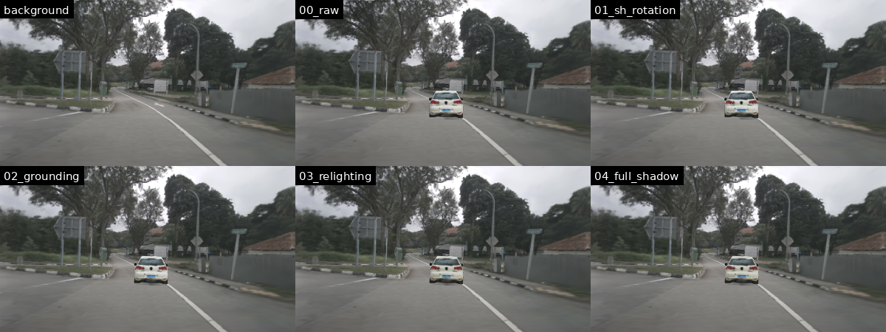
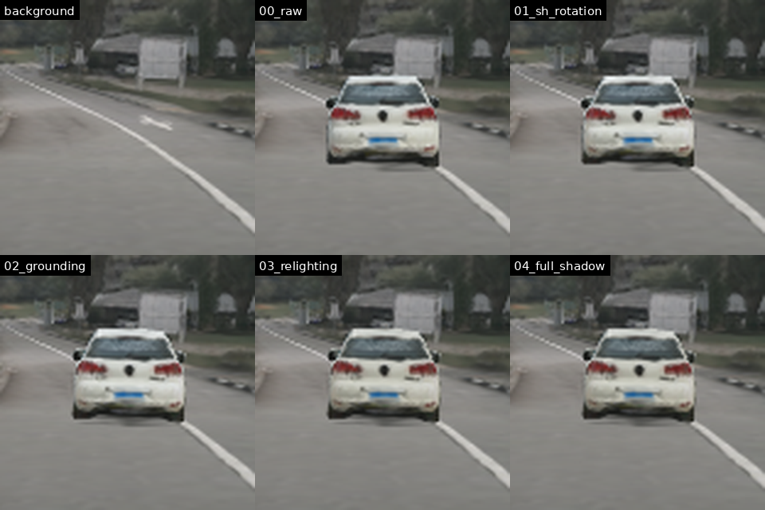

# DecoupleGS

### Interactive 3D Gaussian Splatting for End-to-End Autonomous Driving Testing

**Unofficial, independent reimplementation of the ECCV 2026 paper**

Siying Li · Ying Ni · Jie Sun · Jian Sun · Haotian Shi 
Original paper authors — this repository is not affiliated with or endorsed by them.

Static background, canonical insertion, real-SH rotation, opacity grounding, relighting, and contact shadow on a public HUGSIM/3DRealCar checkpoint.

> [!IMPORTANT]
> This is an **independent reimplementation from the public paper and supplementary material**, built on HUGSIM. It is not the authors' code. As of 25 August 2026, no official DecoupleGS source repository, pretrained weights, custom CUDA rasterizer, or exact evaluation split has been released. We therefore do not claim bit-exact or protocol-exact equivalence to the unpublished implementation.

## Overview

DecoupleGS separates a driving scene into a persistent static 3DGS background and independently controllable canonical vehicle assets. At runtime, each vehicle is compressed, relit, registered to the map and road surface, transformed into the world frame, and merged with the background for one unified rasterization pass.

~~~text
static background ─────────────────────────────────────────────┐
canonical assets → VQ decode → relight → SE(3) / SH rotation ─┼→ unified primitive stream
HD map + trajectory → DTW → SE(2) → opacity grounding ────────┘             │
                                                                            ▼
                                                             one CUDA rasterization
                                                                            │
                                                             UniAD / VAD closed loop
~~~

The implementation follows the disclosed paper settings, including 30k background iterations, 20k vehicle iterations, a 0.005 pruning threshold, 1024/512 color/shape codebooks, 0.99 EMA momentum, five-pixel dynamic-mask dilation, 27-D local SH probes, and a 2 Hz closed-loop policy update.

## Implemented components

| Paper component | Implementation | Status |
|---|---|---|
| Object-centric canonical decomposition | <code>decouplegs/types.py</code>, <code>transforms.py</code> | Implemented |
| Degree 0–3 real-SH Wigner-D rotation | <code>RealSHRotator</code> | Implemented and equivariance-tested |
| Importance pruning + K-Means/EMA VQ | <code>compression.py</code> | Implemented |
| DTW + SE(2) Orthogonal Procrustes | <code>registration.py</code> | Implemented |
| Opacity-accumulated vertical grounding | <code>registration.py</code> | Implemented |
| Local SH probe + affine OLS relighting | <code>relighting.py</code>, <code>hdri_protocol.py</code> | Implemented with a public replacement calibration protocol |
| Parametric contact shadow | <code>relighting.py</code> | Implemented |
| Unified static/dynamic rasterization | <code>rasterizer.py</code>, <code>gaussian_renderer/</code> | Implemented on HUGSIM_splat |
| Static radix cache + dynamic insertion | <code>rasterizer.py</code> | Exact same-camera cache implemented |
| IDM/MOBIL background agents | <code>behavior.py</code> | Implemented |
| UniAD/VAD closed-loop evaluation | <code>closed_loop.py</code>, <code>tools/run_decouplegs_closed_loop_suite.py</code> | Implemented |

The paper's unpublished fused CUDA kernels are not available. This repository uses a one-call HUGSIM_splat path plus an independently developed static-stream cache and stable dynamic insertion path.

## Visual results

  

The checked-in visualization is generated from a public HUGSIM scene and 3DRealCar asset. Its relighting stage uses the documented adaptive fallback because the original HDRI supervision and per-asset OLS calibration are not public. Generate the same cumulative ablation on your checkpoints with:

~~~bash
conda activate decouplegs
python tools/render_decouplegs_effects.py \
  /path/to/exported/scene-0013 \
  /path/to/3DRealCar/car-id/gs.pth \
  artifacts/my-decouplegs-effects \
  --scale 0.5 --distance 14
~~~

The command writes full-frame comparisons, vehicle crops, amplified difference maps, individual stages, timings, and pixel-change metrics.

## Reproduction coverage

The current public replacement protocol has been exercised on:

- 20 public 3DRealCar canonical assets with full 5,000-step EMA-VQ;
- eight reconstructed nuScenes scenes and 1,440 open-loop camera images;
- 1,296 temporally held-out re-insertion views across ten vehicle tracks;
- 400 strict closed-loop episodes covering UniAD/VAD × four difficulty levels × 50 episodes;
- dense runtime stress tests up to 50 simultaneous dynamic agents;
- CPU numerical tests plus CUDA forward/backward and raster-equivalence checks.

These runs establish that the released pipeline is executable end to end. They do not recreate the authors' private asset identities, clips, HDRI targets, planner seeds, or custom kernels.

## Installation

### Requirements

- Linux
- NVIDIA GPU with CUDA 11.8
- GCC/G++ 11
- Conda or Miniconda
- PyTorch 2.4.1 + CUDA 11.8

The setup script can clone an existing compatible Conda environment so package caches and already installed dependencies are reused:

~~~bash
git clone https://github.com/Functionhx/DecoupleGS.git
cd DecoupleGS

bash tools/setup_decouplegs_conda.sh YOUR_EXISTING_ENV decouplegs
conda activate decouplegs
~~~

For a fresh environment:

~~~bash
conda env create -f environment-decouplegs.yml
bash tools/setup_decouplegs_conda.sh decouplegs decouplegs
conda activate decouplegs
~~~

Override toolkit/compiler detection when needed:

~~~bash
DECUPLEGS_CUDA_ROOT=/usr/local/cuda-11.8 \
DECUPLEGS_CC=/usr/bin/gcc-11 \
DECUPLEGS_CXX=/usr/bin/g++-11 \
bash tools/setup_decouplegs_conda.sh YOUR_EXISTING_ENV decouplegs
~~~

See the [full reproduction guide](docs/decouplegs_reimplementation.md) for data preparation, background reconstruction, asset compression, map registration, relighting calibration, rendering, and closed-loop evaluation.

## Quick verification

~~~bash
conda activate decouplegs

PYTEST_DISABLE_PLUGIN_AUTOLOAD=1 python -m pytest -q tests
python tools/smoke_test_decouplegs_cuda.py
pip check
~~~

Core geometry, compression, registration, relighting, traffic behavior, and metric tests can run without loading a complete driving scene. The CUDA smoke test additionally checks <code>simple-knn</code>, UniDepth KNN, and the unified rasterizer forward/backward paths.

## Data

This repository does not redistribute nuScenes, PandaSet, SAM weights, planner weights, or 3DRealCar checkpoints.

- [HUGSIM scenes and scenarios](https://huggingface.co/datasets/XDimLab/HUGSIM)
- [3DRealCar toolkit](https://github.com/xiaobiaodu/3DRealCar_Toolkit)
- [nuScenes](https://www.nuscenes.org/)
- [PandaSet](https://github.com/scaleapi/pandaset-devkit)
- [Segment Anything](https://github.com/facebookresearch/segment-anything)
- [MapTR / MapTRv2](https://github.com/hustvl/MapTR)
- [UniAD](https://github.com/OpenDriveLab/UniAD)
- [VAD](https://github.com/hustvl/VAD)

Edit the portable manifests under <code>configs/benchmark/</code> to point to the corresponding local downloads. Generated checkpoints and <code>results/</code> are intentionally excluded from Git.

## Repository layout

~~~text
decouplegs/                 core decomposition, compression, registration,
                            relighting, rasterization, behavior and metrics
gaussian_renderer/          HUGSIM renderer integration
sim/                        closed-loop HUGSIM environment integration
tools/                      preparation, compression, rendering and evaluation CLIs
configs/                    paper hyperparameters and frozen public protocols
tests/                      numerical and protocol regression tests
artifacts/                  lightweight checked-in visual demonstrations
docs/                       detailed reproduction and protocol documentation
~~~

## Acknowledgements

This work is built on [HUGSIM](https://github.com/hyzhou404/HUGSIM) and retains its MIT license and attribution. It also relies on ideas, code, models, or data from the original [3D Gaussian Splatting](https://github.com/graphdeco-inria/gaussian-splatting), [3DRealCar](https://github.com/xiaobiaodu/3DRealCar_Toolkit), [LightGaussian](https://github.com/VITA-Group/LightGaussian), [SAM](https://github.com/facebookresearch/segment-anything), [MapTR](https://github.com/hustvl/MapTR), [UniAD](https://github.com/OpenDriveLab/UniAD), and [VAD](https://github.com/hustvl/VAD) projects.

## Citation

Please cite the original DecoupleGS paper:

~~~bibtex
@misc{li2026decouplegs,
  title        = {DecoupleGS: Interactive 3D Gaussian Splatting for
                  End-to-End Autonomous Driving Testing},
  author       = {Li, Siying and Ni, Ying and Sun, Jie and
                  Sun, Jian and Shi, Haotian},
  year         = {2026},
  eprint       = {2608.01761},
  archivePrefix= {arXiv},
  primaryClass = {cs.CV}
}
~~~

Please also cite HUGSIM when using this implementation:

~~~bibtex
@article{zhou2024hugsim,
  title   = {HUGSIM: A Real-Time, Photo-Realistic and Closed-Loop
             Simulator for Autonomous Driving},
  author  = {Zhou, Hongyu and Lin, Longzhong and Wang, Jiabao and
             Lu, Yichong and Bai, Dongfeng and Liu, Bingbing and
             Wang, Yue and Geiger, Andreas and Liao, Yiyi},
  journal = {arXiv preprint arXiv:2412.01718},
  year    = {2024}
}
~~~

---

Reproducibility note: [metric protocol and paper-value differences](docs/metric_differences.md).
